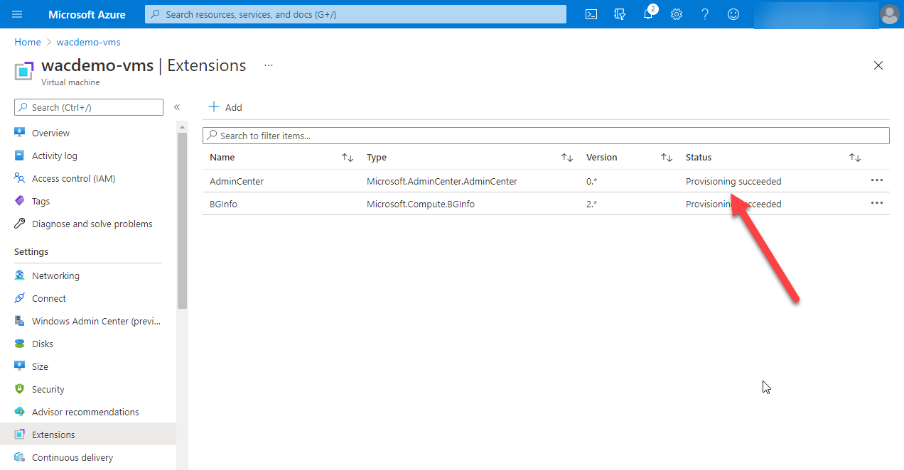

## Overview
This PowerShell script builds a quick environment with a single VM which can be used to demonstrate Windows Admin Center (WAC). The WAC Extension is installed by the build script and an NSG configured to allow access only from the IP where the script is run from.

## Configuring the demo environment
1. Open a PowerShell session
2. Run ``Connect-AzAccount`` to sign in to Azure
3. Run the Powershell script [build-wacdemo.ps1](build-wacdemo.ps1)

***OR***
1. Sign into the Azure Portal
2. Open a Cloud Shell (choose PowerShell)
3. Edit [build-wacdemo.ps1](build-wacdemo.ps1). Find the line that defines ``$MyIP=`` and set this variable to the public IP of your workstation for example ``$MyIP=1.2.3.4``
4. Copy and Paste the contents of the edited [build-wacdemo.ps1](build-wacdemo.ps1) into your CloudShell session.

## Connecting to Windows Admin Center
1. Locate the Virtual Machine ``wacdemo-vms`` in the Azure Portal
2. On the menu select ``Windows Admin Center (preview)``
3. Select the ``Public IP address`` in the drop-down and click ``Connect``

4. Enter the Username ``LocalAdminUser`` and the Password ``P@ssW0rD!``. Then click ``Sign In``

## Troubleshooting
If the login to Windows Admin Center silently fails, check that the AdminCenter Extension is successfully provisioned.

If instead of ``Provisioning succeeded`` it says ``Transitioning`` then wait a short time.

Most other situations have good explanations as to what has gone wrong, for example if your VM is turned off.

